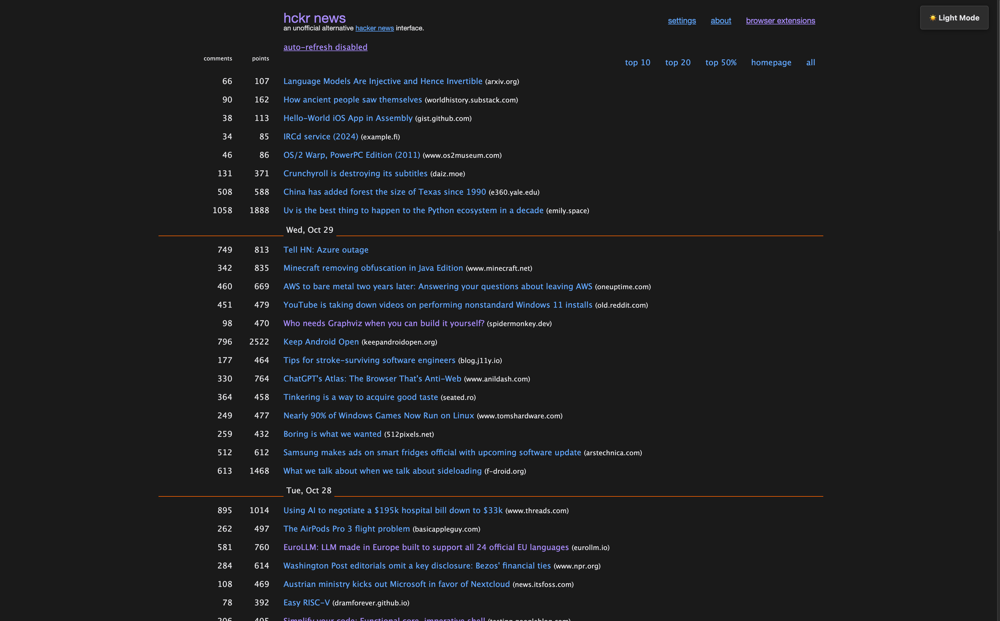

# 🌙 HckrNews Dark Mode Chrome Extension

Persistent, beautiful dark mode for [hckrnews.com](https://hckrnews.com) with instant toggling from both the extension popup and an in-page button!

---

## Features

- Toggle dark mode instantly via popup or in-page button
- Remembers your preference across all sessions
- Accessible, easy-on-the-eyes color palette
- Lightweight & fast—no tracking, no nonsense
- Open source, customizable CSS

---

## Installation

1. Download or clone this repo: `git clone https://github.com/abdul/hckrnews-dark-mode.git`
2. Open Chrome and go to `chrome://extensions/`
3. Enable **Developer mode** (top right)
4. Click **Load unpacked** and select this folder
5. Use hckrnews.com in dark mode!

---

## Usage

- **Popup toggle:** Click the extension icon, then click "🌙 Dark Mode" or "☀️ Light Mode"
- **In-page toggle:** Use the button in the top-right corner of the site
- Your choice is remembered automatically

---

## Screenshots

- 

---

## Author

**Abdul Qabiz**
- Website: [abdulqabiz.com](https://www.abdulqabiz.com)
- GitHub: [github.com/abdul](https://github.com/abdul)
- Extension Repo: [github.com/abdul/hckrnews-dark-mode](https://github.com/abdul/hckrnews-dark-mode)

---

## License

MIT License. See [LICENSE](LICENSE).

---

## Contributing

Pull requests welcome!
1. Fork the repo
2. Create a branch (`git checkout -b feature/your-feature`)
3. Commit, push, open a PR

For major changes, please create an issue to discuss.

---

## Acknowledgments

- Inspired by the Hacker News community!
